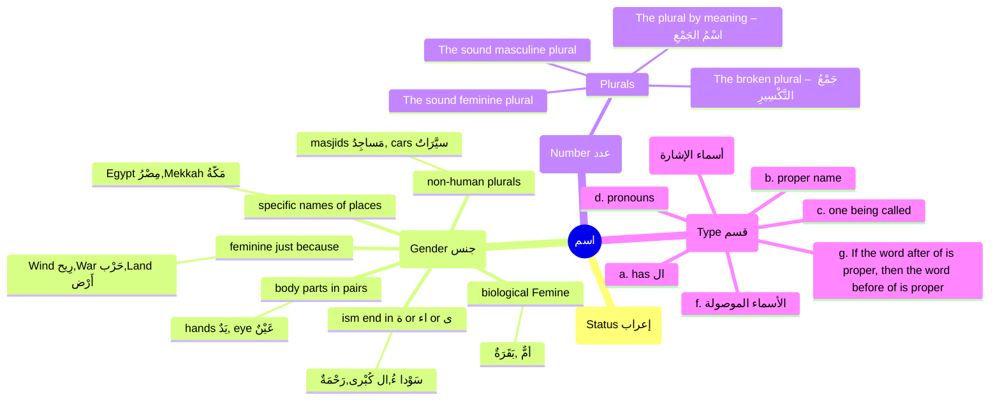

# Arabic mindmap

# Plurals
## Broken plural patterns that appear in the Qur’an

| Singular | Plural | Meaning | Singular | Plural | Meaning |
|---|---|---|---|---|---|
| زَوْج | أَزْوَاج | one of a pair | شَاهِد | شُهَدَاء | witness |
| فُؤَاد | أَفْئِدَة | emotional heart | نِعْمَة | نِعَم | blessing |
| اِمْرَأَة | نِسَاء | woman | نَبِيّ | أَنْبِيَاء | prophet |

Notice that some broken plural patterns are partly flexible and some are fully flexible.

## Plural by meaning

There are words that appear to be singular, but they are treated as plural because they carry a plural meaning, referring to a group made up of many members.

| Arabic | Meaning | Arabic | Meaning |
|---|---|---|---|
| قَوْم | a nation / a people | خَصْم | an argumentative group / opponents |
| نَاس | people | حِزْب | a faction / a party |
| قَرْن | a generation | جُنْد | an army / troops |
| آل | family / people | أَهْل | family / people |

## Grammatical treatment of plurals

There are two main rules governing the grammatical treatment of plurals.

1. **Non-human plurals** are treated as **singular feminine**.  
   Example: **سَيَّارَات**

2. **Human plurals** are generally treated according to their natural gender and meaning.
   - **Sound masculine plural** → **plural masculine**  
     Example: **مُسْلِمُونَ**
   - **Sound feminine plural** → **plural feminine**  
     Example: **مُسْلِمَات**
   - **Plural by meaning** → usually **plural masculine**  
     Example: **قَوْم**
   - **Human broken plurals** → may be **singular feminine**, **plural masculine**, or **plural feminine**, depending on usage  
     Example: **قَالَتِ الْأَعْرَابُ آمَنَّا**  
     *“The Bedouins said, ‘We believe.’”* — Qur’an 49:14

Here, **الْأَعْرَابُ** is human and plural in meaning, yet the verb **قَالَتْ** is **singular feminine**.