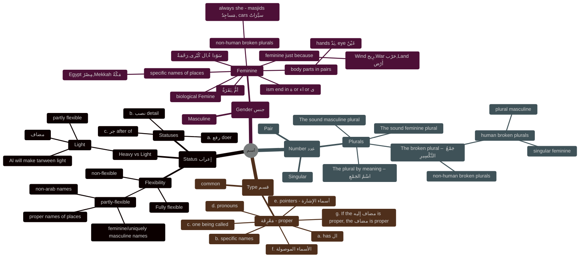
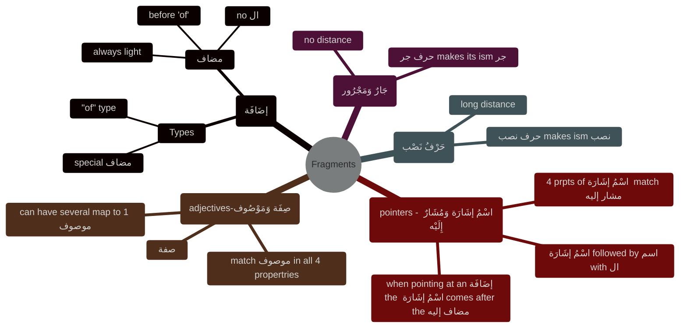
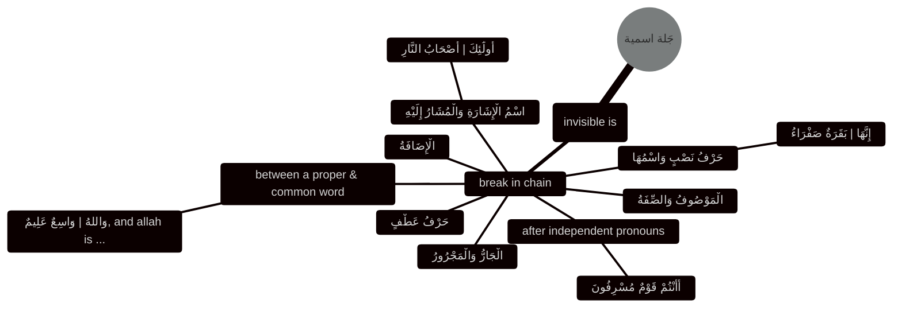

# Arabic mindmap


```mermaid
---
config:
  layout: tidy-tree
  theme: dark
---
mindmap
  root((اسم))
    id(Status إعراب)
      Statuses
        a. رفع doer
        b. نصب detail
        c. جر after of
      Flexibility
        Fully flexible
        non-flexible
        partly-flexible
          non-arab names
          feminine/uniquely masculine names
          proper names of places
      Heavy vs Light
        Light
          partly flexible
          مضاف
          Al will make tanween light

    id(Gender جنس)
      Masculine
      Feminine
        biological Femine
        أمٌّ ,بَقَرَةٌ
        ism end in ة or اء or ى
        سَوْدا ءُ,ال كُبْرى,رَحْمَةٌ
        body parts in pairs
          hands يَدٌ, eye عَيْنٌ
        specific names of places
          Egypt مِصْرُ,Mekkah  مَكَّةُ
        non-human broken plurals
          always she - masjids مَساجِدُ, cars سيَّرَاتٌ
        feminine just because
          Wind رِيح,War حَرْب,Land أَرْض      
    (Number عدد)
        Singular
        Pair
        Plurals
          The sound masculine plural
          The sound feminine plural
          The broken plural – جَمْعُ التَّكْسِيرِ
            human broken plurals
              plural masculine
              singular feminine
            non-human broken plurals
          The plural by meaning – اسْمُ الجَمْعِ
    (Type قسم)
      مَعْرِفَة - proper
        a. has ال
        b. specific names
        c. one being called
        d. pronouns
        e. pointers - أسماء الإشارة
        f. الأسماء الموصولة
        g. If the مضاف إليه is proper, the مضاف is proper
    
      common
      
```
---
# Plurals
## Broken plural patterns that appear in the Qur’an

| Singular | Plural | Meaning | Singular | Plural | Meaning |
|---|---|---|---|---|---|
| زَوْج | أَزْوَاج | one of a pair | شَاهِد | شُهَدَاء | witness |
| فُؤَاد | أَفْئِدَة | emotional heart | نِعْمَة | نِعَم | blessing |
| اِمْرَأَة | نِسَاء | woman | نَبِيّ | أَنْبِيَاء | prophet |

Notice that some broken plural patterns are partly flexible and some are fully flexible.


## Plural by meaning

There are words that appear to be singular, but they are treated as plural because they carry a plural meaning, referring to a group made up of many members.

| Arabic | Meaning | Arabic | Meaning |
|---|---|---|---|
| قَوْم | a nation / a people | خَصْم | an argumentative group / opponents |
| نَاس | people | حِزْب | a faction / a party |
| قَرْن | a generation | جُنْد | an army / troops |
| آل | family / people | أَهْل | family / people |


## Grammatical treatment of plurals

There are two main rules governing the grammatical treatment of plurals.

1. **Non-human plurals** are treated as **singular feminine**.  
   Example: **سَيَّارَات**

2. **Human plurals** are generally treated according to their natural gender and meaning.
   - **Sound masculine plural** → **plural masculine**  
     Example: **مُسْلِمُونَ**
   - **Sound feminine plural** → **plural feminine**  
     Example: **مُسْلِمَات**
   - **Plural by meaning** → usually **plural masculine**  
     Example: **قَوْم**
   - **Human broken plurals** → may be **singular feminine**, **plural masculine**, or **plural feminine**, depending on usage  
     Example: **قَالَتِ الْأَعْرَابُ آمَنَّا**  
     *“The Bedouins said, ‘We believe.’”* — Qur’an 49:14

Here, **الْأَعْرَابُ** is human and plural in meaning, yet the verb **قَالَتْ** is **singular feminine**.


---
# Fragments


```mermaid

---
config:
  layout: tidy-tree
  theme: dark
---
mindmap
  root((Fragments))
    id(إضَافَة)
      Types
        "of" type
        special مضاف
      مضاف
       before 'of'
       always light
       no ال

    id(جَارٌ وَمَجْرُور)
      حرف جر makes its ism جر
      no distance
    id(حَرْفُ نَصْب)
      حرف نصب makes ism نصب
      long distance

    id( adjectives-صِفَة وَمَوْصُوف)
      صفة
      match موصوف in all 4 propertries
      can have several map to 1 موصوف
    
    id(pointers - اسْمُ إشَارَة وَمُشَارٌ إِلَيْه)
      اسْمُ إشَارَة followed by اسم with ال
      4 prpts of اسْمُ إشَارَة  match مشار إليه
      when pointing at an إضَافَة the  اسْمُ إشَارَة comes after the مضاف إليه
```

## **كُلّ**  and **مضاف إليه**

Note that the meaning of **كُلّ** changes depending on the number and type of the **مضاف إليه**. Below are the possible scenarios:

1. **If the مضاف إليه is singular and common**, the meaning is **each and every**.  
   **Example:** **كُلُّ مَسْجِدٍ** — each and every masjid

2. **If the مضاف إليه is singular and definite**, the meaning is **the entire**.  
   **Example:** **كُلُّ الْمَسْجِدِ** — the entire masjid

3. **If the مضاف إليه is plural and definite**, the meaning is **all of**.  
   **Example:** **كُلُّ الْمَسَاجِدِ** — all of the masjids


   # Sentences
Every جَلة اسمية contains an invisible is. Youf find the is by using the break in chain


```mermaid

---
config:
  layout: tidy-tree
  theme: dark
---
mindmap
  root((جَلة اسمية))
    id(invisible is)
      break in chain
        after independent pronouns
          أَأَنْتُمْ قَوْمٌ مُسْرِفُونَ
        between a proper & common word
          وَاللهُ | وَاسِعٌ عَلِيمٌ, and allah is ...
        الْجَارُّ وَالْمَجْرُورُ     
        حَرْفُ نَصْبٍ وَاسْمُهَا
          إِنَّهَا | بَقَرَةٌ صَفْرَاءُ
        الْإِضَافَةُ
        الْمَوْصُوفُ وَالصِّفَةُ
        اسْمُ الْإِشَارَةِ وَالْمُشَارُ إِلَيْهِ
          أُولَٰئِكَ | أَصْحَابُ النَّارِ
        حَرْفُ عَطْفٍ

```

# Fil

```mermaid
---
config:
  layout: tidy-tree
  theme: dark
---
mindmap
  root((فعل))
    الفِعْلُ الْمَاضِي – the past-tense فعل
      فَاعِل
        inside doer
        outside doer
          after  فعل
          is  **مَرْفُوعٌ*
           The فعل must be in either the **هُوَ** form or the **هِيَ** form
           The فعل will **MATCH** the فَاعِل in **GENDER**
    الفِعْلُ الْمُضَارِعُ – the present/future-tense فعل
    فِعْلُ الْأَمْرِ/النَّهْيِ – the imperative
````


## Fil past tense - الفِعْلُ الْمَاضِي 

A فعل in Arabic differs from an English verb in that every فعل contains a pronoun inside of it. This pronoun
serves as a doer. Together, an action and a doer make a full sentence. Because a فعل contains both, it is
considered a full sentence, a جُمْلَة فِعْلِيَّة

### الفَاعِل – The Doer

The فَاعِل is the doer of the action. There are two types of فَاعِل:

1. **الضَّمِيرُ الْمُسْتَتِرُ** (Inside فَاعِل) – This is the built-in pronoun that every فعل contains.
2. **فَاعِلٌ ظَاهِرٌ** (Outside فَاعِل) – This type of فَاعِل is used when the doer is someone or something other than a pronoun (e.g., "Muhammad" rather than "he").

#### Rules for an Outside فَاعِل:

1. It must come **AFTER** the فعل
2. It must be **مَرْفُوعٌ** (nominative)
3. The فعل must be in either the **هُوَ** form or the **هِيَ** form
4. The فعل will **MATCH** the فَاعِل in **GENDER**

#### Examples:

| English | Arabic |
|---|---|
| Allah helped you at Badr | نَصَرَكُمُ اللَّهُ بِبَدْرٍ
| The Muslim helped.       | نَصَرَ الْمُسْلِمُ  |
| The two Muslims helped.  | نَصَرَ الْمُسْلِمَانِ |
| The Muslims helped.      | نَصَرَ الْمُسْلِمُونَ |
| The Muslimah helped.     | نَصَرَتْ الْمُسْلِمَةُ  |
| The two Muslimahs helped.| نَصَرَتْ الْمُسْلِمَتَانِ  |
| The Muslimahs helped.    | نَصَرَتْ الْمُسْلِمَاتُ  |

**Note:** Only the **هُوَ** form and the **هِيَ** form are used despite the variety in the number of the outside فَاعِل. Also notice that the فعل and outside فَاعِل match in gender.