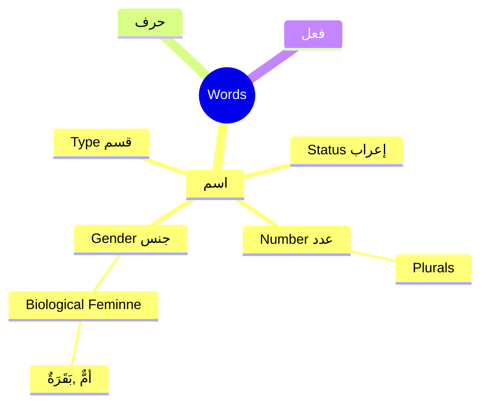

# Arabic mindmap

```mermaid
---
config:
  layout: tidy-tree
---
mindmap
  root((Words))
    اسم
      Status إعراب
      Number عدد
        Plurals
      Gender جنس
        Biological Feminne
         أمٌّ ,بَقَرَةٌ
         
         
      Type قسم
    حرف
    فعل
```

